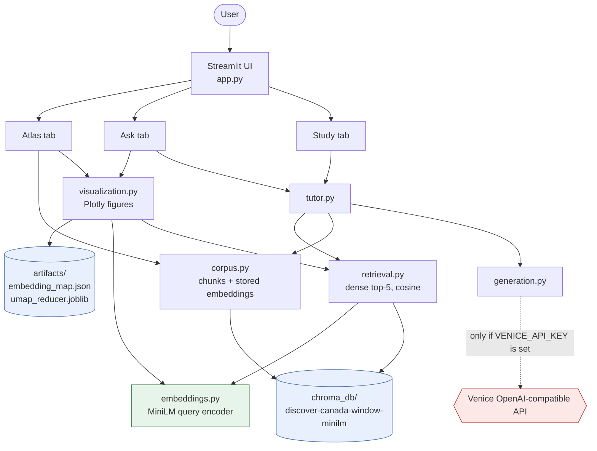
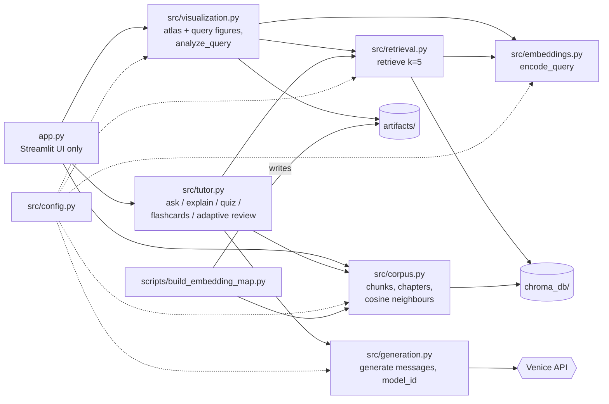
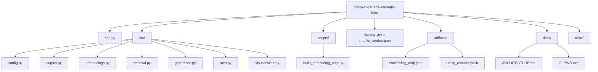

# Architecture

Discover Canada Atlas is a single-process **Streamlit** app over a **frozen** retrieval index.
There is no web server besides Streamlit, no database server, and no frontend build.
Diagrams below describe what is actually in the code.

## 1. Runtime components

Legend: 🟦 local static data · 🟩 local model computation · 🟥 external API call.



- **Local static data**: `chroma_db/` (236 chunks + 384-d MiniLM vectors), `artifacts/` (UMAP map + fitted reducer).
- **Local model computation**: MiniLM encodes *queries only* (corpus vectors are read from Chroma); UMAP `transform` projects a query into the map.
- **External API**: Venice, called only from `generation.py`, only for Ask / Explain / Quiz / Flashcards / free-response grading.

## 2. Modules



| File | Owns |
|---|---|
| `app.py` | Receives UI actions, holds `st.session_state`, renders. No retrieval algorithms or prompts. |
| `src/config.py` | Frozen retrieval constants, artifact paths, UMAP params, env access (`VENICE_*`). |
| `src/corpus.py` | Loads all chunks + embeddings from Chroma; chapter derivation; cosine neighbours. |
| `src/embeddings.py` | The MiniLM encoder; `encode_query` (normalized). |
| `src/retrieval.py` | Frozen dense retrieval; Chroma safety guards (cosine space, embedding model). |
| `src/generation.py` | The **only** module that knows Venice. `generate(messages, model_id=None)`. |
| `src/tutor.py` | Prompts, citations, quiz/flashcards/explain, MMR diversity, adaptive review. |
| `src/visualization.py` | Loads the map + reducer, projects queries, builds Plotly figures. |
| `scripts/build_embedding_map.py` | One-off: fit UMAP on stored embeddings, write `artifacts/`. |

## 3. File tree

```
discover-canada-semantic-tutor/
├── app.py
├── README.md  AGENTS.md  CLAUDE.md  requirements.txt
├── .env            # user-owned secrets, never read by tooling
├── .env.example    # placeholders only
├── .streamlit/config.toml
├── chroma_db/                 # frozen index (collection discover-canada-window-minilm)
├── chunks_window.json         # canonical chunk copy (used by tests)
├── discover_canada.pdf
├── reference_rag.py           # research reference (tests compare against it)
├── environment_reference.yml
├── src/
│   ├── config.py  corpus.py  embeddings.py  retrieval.py
│   └── generation.py  tutor.py  visualization.py
├── scripts/build_embedding_map.py
├── artifacts/                 # embedding_map.json, umap_reducer.joblib
├── docs/                      # ARCHITECTURE.md, FLOWS.md
└── tests/test_smoke.py
```



## 4. Questions a new developer asks

1. **What happens when a user types a query?** `app.py` → `visualization.analyze_query` encodes it once (`embeddings.encode_query`), retrieves top-5 with that vector (`retrieval.retrieve`), and projects the same vector with the saved UMAP reducer. Ask/Explain then call `tutor`. See [FLOWS.md](FLOWS.md) §A, §C.
2. **Which module calls which?** Section 2 diagram. Direction: `app` → `tutor`/`visualization`/`corpus` → `retrieval`/`generation` → `embeddings`/`corpus`/`config`.
3. **Where do embeddings come from?** Corpus vectors were computed in the research repo and live in Chroma; `corpus.load_corpus` reads them. Only *queries* are embedded at runtime (MiniLM, normalized).
4. **What is retrieved from Chroma?** `collection.query` → ids, documents, metadatas (page, section, block_type, …) and cosine distances; similarity = 1 − distance. No threshold, no reranking.
5. **What does UMAP do / not do?** It places chunks (and the query) on a 2-D map for humans to look at. It is **never** used for retrieval, neighbours, or diversity; those use the original 384-d cosine similarity. Points that look far apart on the map can be close in embedding space, and vice-versa.
6. **When is Venice called?** Only in `generation.generate`: Ask, Explain, quiz question writing + verification, free-response grading, flashcards.
7. **Which features work without Venice?** Atlas (filters, inspector, neighbours), query view (retrieval + map), MCQ *grading* of an already-generated question. Generation features show `VENICE_API_KEY is not configured.`
8. **What happens on a quiz request?** [FLOWS.md](FLOWS.md) §B: pick a source chunk in scope → fetch semantic-neighbour context → LLM writes question → second LLM call verifies exactly one supported option → shuffle → grade locally → record in session state.
9. **How does adaptive review use neighbours?** After a miss, `tutor.review_candidates` takes the missed chunk's nearest chunks (cosine, one per other section, minus ones already answered correctly); the user can quiz or get an explanation over that neighbourhood.
10. **Where does each responsibility live?** Table in section 2.
