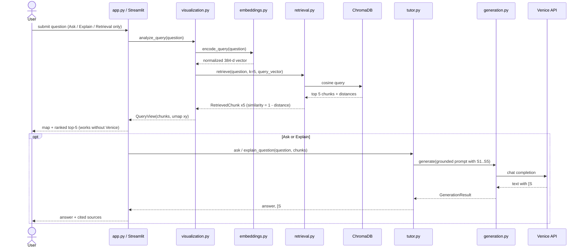
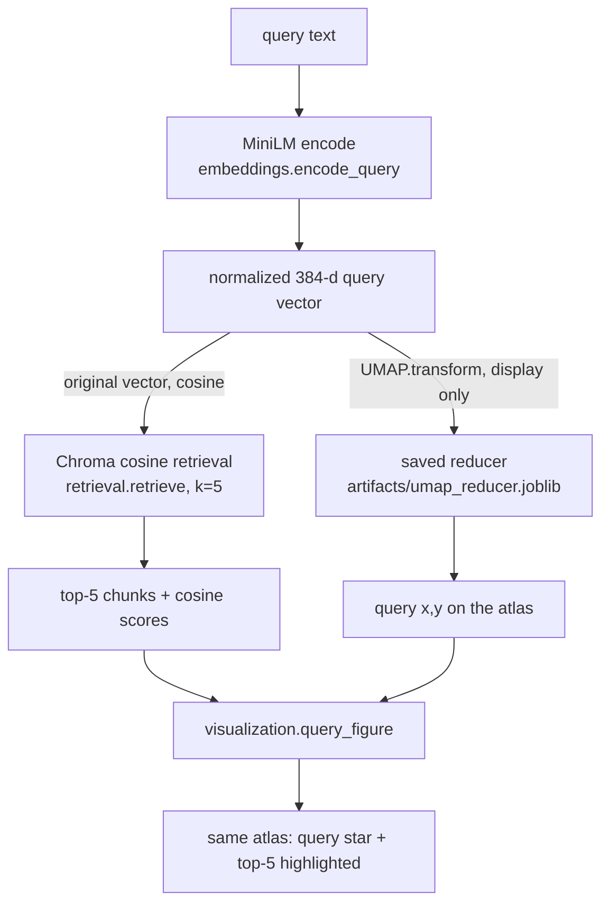

# Runtime flows

All flows reflect the implemented call paths. UMAP is display-only.

## A. Ask / Explain

`app.py` retrieves and draws the map **first**; generation runs afterwards so the retrieval view is
visible while the LLM works. The retrieved chunks from the atlas query are reused (no second retrieval).



## B. Quiz (multiple choice)

```mermaid
sequenceDiagram
    actor U as User
    participant UI as app.py
    participant T as tutor.py
    participant Co as corpus.py
    participant G as generation.py (Venice)

    U->>UI: New question (scope: guide / chapter / section / current query)
    UI->>T: generate_quiz(kind="mcq", scope, difficulty, exclude asked chunks)
    T->>T: pick_quiz_chunk (random usable chunk in scope)
    T->>Co: pick_distractor_passages(source, difficulty)
    Co-->>T: other-section passages ranked by cosine to source (original embeddings);<br/>difficulty slider picks the band: hard = nearest, easy = farthest
    T->>G: write question + 3 wrong answers, each drawn from a different passage
    G-->>T: JSON (question, correct answer, tagged distractors)
    T->>T: shuffle options in code
    T->>G: verify: which options does the source support?
    G-->>T: supported letters
    alt exactly one and it is the correct one
        T-->>UI: QuizQuestion (retry up to 3x otherwise)
    end
    UI-->>U: question + options
    U->>UI: choose answer
    UI->>T: grade_mcq (local, no LLM)
    T-->>UI: correct/incorrect + explanation + source page/section
    UI->>UI: append AnswerRecord to st.session_state.history
    opt answer was wrong
        UI->>T: review_candidates(missed chunk, history)
        T->>Co: neighbours of missed chunk, excluding chunks already answered correctly
        T-->>UI: nearby concepts
        U->>UI: Quiz nearby / Explain this neighbourhood
        UI->>T: generate_quiz(focus_chunk_id=neighbour) / explain_neighbourhood
    end
```

The difficulty slider (0 easy – 1 hard) is *similarity*: the wrong answers come from passages whose cosine
similarity to the source passage is high (hard) or low (easy). After answering, the UI shows each wrong
answer's source section and cosine, plus the measured cosine between the option texts. (Euclidean distance
on these unit vectors ranks identically to cosine.)

Free response differs only in that the LLM writes a question + reference answer (no distractors or
verification) and `grade_free` asks the LLM to judge the student's answer against the source.

## C. Atlas query flow

One query embedding, two distinct uses.



- The 3-D view (three.js) uses a second reducer fitted with `n_components=3`; the same single query vector is passed through it (`project_query_3d`). It is a display alternative to the 2-D Plotly map and follows the same rule.
- Retrieval uses the **original** embedding and cosine similarity.
- Visualization uses UMAP **only** to project the query into the 2-D atlas.
- UMAP coordinates are never a replacement for retrieval similarity: a retrieved chunk can appear far
  from the star, and the UI says so rather than hiding it.

## D. Atlas inspector

```mermaid
sequenceDiagram
    actor U as User
    participant UI as app.py
    participant V as visualization.py
    participant Co as corpus.py

    U->>UI: set filters (chapter / section / block type)
    UI->>V: atlas_figure(visible ids) - filtered-out points stay as faint grey
    U->>UI: click a point (Plotly selection -> chunk_id)
    UI->>Co: row(chunk_id), neighbours(chunk_id, 5)
    Co-->>UI: full text + metadata + cosine neighbours (original embeddings)
    UI-->>U: inspector; neighbours ringed on the map
```

In the 3-D view the same flow applies, except the click is captured in `atlas3d.js` (raycast on an instanced mesh) and returned to Python with `setTriggerValue('selected', chunk_id)`.

No generation is involved unless the user presses **Explain this chunk**.
